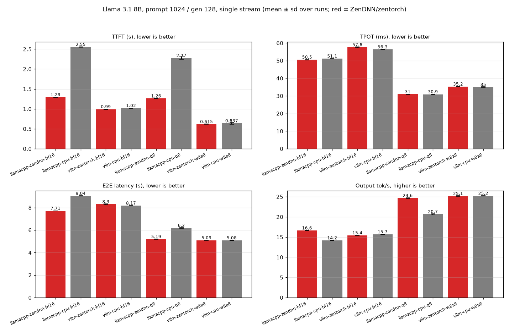
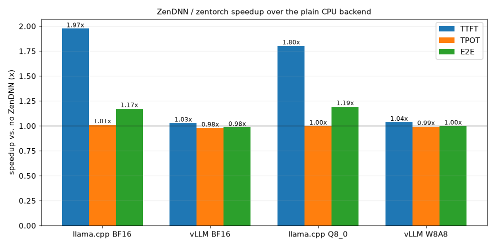
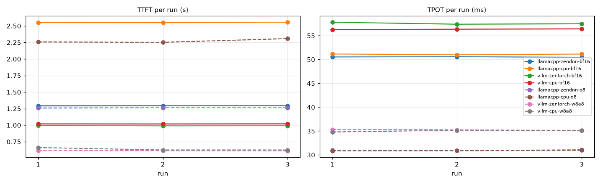

# Smoke test: Llama 3.1 8B Instruct, prompt 1024 / generate 128

## Setup

```
date: 2026-09-27T18:35:29+00:00 (W8A8 rows 18:49)
host: volcano-a942-host  cpu: AMD EPYC 9R14 96-Core Processor
server cpus: 0-95 (+SMT 192-287 for vLLM frontend)  mem node: 0  client cpus: 96-97
llama.cpp: 9adc7f420 convert : export YaRN scaling parameters for PLaMo-3 (#29528)  LD_PRELOAD=/home/zettabolt/vllm-zen/env/lib/libiomp5.so:/home/zettabolt/vllm-zen/env/lib/libtcmalloc_minimal.so.4
vllm-zentorch: torch 2.13.0+cpu,vllm 0.28.0+cpu,zentorch 2.13.0.1
vllm-cpu: torch 2.13.0+cpu,vllm 0.28.0+cpu
```

Each config runs alone. The server is pinned with `numactl --physcpubind` to the server CPUs and `--membind` to the local NUMA node, with one compute thread per physical core. vLLM compute threads are bound via `VLLM_CPU_OMP_THREADS_BIND`; its API frontend may use the SMT siblings of the same cores. The client runs on other cores. Both engines run with the same preloaded runtime: LLVM OpenMP (libiomp5) and tcmalloc. Every request is a streaming `/v1/completions` call with exactly 1024 prompt token IDs (BOS + random ordinary-vocabulary IDs, fresh per request, so no prefix-cache reuse), `max_tokens=128`, `ignore_eos`, temperature 0. One warmup request, then 3 measured runs of one request each. TTFT = time to first streamed token; TPOT = (E2E - TTFT) / 127.

## Results (mean ± sd over runs)

| config | runs | TTFT (s) | TPOT (ms) | E2E latency (s) | Prefill (tok/s) | Decode (tok/s) | Output throughput (tok/s) | max CV % | tokens 1024/128 |
|---|---|---|---|---|---|---|---|---|---|
| llamacpp-zendnn-bf16 | 3 | 1.292 ± 0.001 | 50.51 ± 0.07 | 7.708 ± 0.009 | 792.4 ± 0.4 | 19.80 ± 0.03 | 16.61 ± 0.02 | 0.13 | ok |
| llamacpp-cpu-bf16 | 3 | 2.552 ± 0.003 | 51.09 ± 0.09 | 9.040 ± 0.014 | 401.3 ± 0.5 | 19.57 ± 0.03 | 14.16 ± 0.02 | 0.18 | ok |
| vllm-zentorch-bf16 | 3 | 0.990 ± 0.002 | 57.56 ± 0.22 | 8.301 ± 0.030 | 1034.1 ± 2.2 | 17.37 ± 0.07 | 15.42 ± 0.05 | 0.38 | ok |
| vllm-cpu-bf16 | 3 | 1.018 ± 0.001 | 56.34 ± 0.07 | 8.174 ± 0.009 | 1005.6 ± 0.8 | 17.75 ± 0.02 | 15.66 ± 0.02 | 0.12 | ok |
| llamacpp-zendnn-q8 | 3 | 1.261 ± 0.002 | 30.97 ± 0.09 | 5.194 ± 0.012 | 812.3 ± 1.0 | 32.29 ± 0.10 | 24.64 ± 0.06 | 0.3 | ok |
| llamacpp-cpu-q8 | 3 | 2.272 ± 0.031 | 30.89 ± 0.06 | 6.196 ± 0.038 | 450.7 ± 6.1 | 32.37 ± 0.06 | 20.66 ± 0.13 | 1.36 | ok |
| vllm-zentorch-w8a8 | 3 | 0.615 ± 0.004 | 35.24 ± 0.09 | 5.091 ± 0.015 | 1666.4 ± 9.6 | 28.37 ± 0.07 | 25.14 ± 0.07 | 0.58 | ok |
| vllm-cpu-w8a8 | 3 | 0.637 ± 0.021 | 35.01 ± 0.19 | 5.083 ± 0.005 | 1609.2 ± 52.6 | 28.56 ± 0.15 | 25.18 ± 0.03 | 3.33 | ok |

## ZenDNN speedup (baseline / accelerated; > 1 means ZenDNN is faster)

| pair | with ZenDNN | without | TTFT speedup | TPOT speedup | E2E speedup |
|---|---|---|---|---|---|
| llama.cpp BF16 | llamacpp-zendnn-bf16 | llamacpp-cpu-bf16 | 1.97x | 1.01x | 1.17x |
| vLLM BF16 | vllm-zentorch-bf16 | vllm-cpu-bf16 | 1.03x | 0.98x | 0.98x |
| llama.cpp Q8_0 | llamacpp-zendnn-q8 | llamacpp-cpu-q8 | 1.80x | 1.00x | 1.19x |
| vLLM W8A8 | vllm-zentorch-w8a8 | vllm-cpu-w8a8 | 1.04x | 0.99x | 1.00x |







## Per-run data

| label | run | ttft_s | tpot_ms | e2e_s | prompt_tokens | completion_tokens |
|---|---|---|---|---|---|---|
| llamacpp-zendnn-bf16 | 1 | 1.292 | 50.52 | 7.708 | 1024 | 128 |
| llamacpp-zendnn-bf16 | 2 | 1.293 | 50.58 | 7.716 | 1024 | 128 |
| llamacpp-zendnn-bf16 | 3 | 1.293 | 50.444 | 7.699 | 1024 | 128 |
| llamacpp-cpu-bf16 | 1 | 2.551 | 51.147 | 9.047 | 1024 | 128 |
| llamacpp-cpu-bf16 | 2 | 2.549 | 50.983 | 9.024 | 1024 | 128 |
| llamacpp-cpu-bf16 | 3 | 2.555 | 51.131 | 9.049 | 1024 | 128 |
| vllm-zentorch-bf16 | 1 | 0.993 | 57.807 | 8.334 | 1024 | 128 |
| vllm-zentorch-bf16 | 2 | 0.988 | 57.395 | 8.278 | 1024 | 128 |
| vllm-zentorch-bf16 | 3 | 0.99 | 57.483 | 8.29 | 1024 | 128 |
| vllm-cpu-bf16 | 1 | 1.018 | 56.271 | 8.165 | 1024 | 128 |
| vllm-cpu-bf16 | 2 | 1.017 | 56.351 | 8.174 | 1024 | 128 |
| vllm-cpu-bf16 | 3 | 1.019 | 56.41 | 8.183 | 1024 | 128 |
| llamacpp-zendnn-q8 | 1 | 1.259 | 30.965 | 5.191 | 1024 | 128 |
| llamacpp-zendnn-q8 | 2 | 1.262 | 30.879 | 5.184 | 1024 | 128 |
| llamacpp-zendnn-q8 | 3 | 1.261 | 31.067 | 5.207 | 1024 | 128 |
| llamacpp-cpu-q8 | 1 | 2.258 | 30.841 | 6.174 | 1024 | 128 |
| llamacpp-cpu-q8 | 2 | 2.252 | 30.881 | 6.174 | 1024 | 128 |
| llamacpp-cpu-q8 | 3 | 2.308 | 30.961 | 6.24 | 1024 | 128 |
| vllm-zentorch-w8a8 | 1 | 0.618 | 35.331 | 5.105 | 1024 | 128 |
| vllm-zentorch-w8a8 | 2 | 0.614 | 35.246 | 5.09 | 1024 | 128 |
| vllm-zentorch-w8a8 | 3 | 0.611 | 35.156 | 5.076 | 1024 | 128 |
| vllm-cpu-w8a8 | 1 | 0.661 | 34.797 | 5.08 | 1024 | 128 |
| vllm-cpu-w8a8 | 2 | 0.625 | 35.153 | 5.089 | 1024 | 128 |
| vllm-cpu-w8a8 | 3 | 0.624 | 35.081 | 5.08 | 1024 | 128 |

## Server startup (s to /health 200)

```
vllm-zentorch-bf16 69
vllm-cpu-bf16 72
vllm-zentorch-w8a8 52
vllm-cpu-w8a8 70
llamacpp-zendnn-bf16 3
llamacpp-cpu-bf16 3
llamacpp-zendnn-q8 3
llamacpp-cpu-q8 3
```

## Backend evidence from server logs

```
INFO 09-27 18:36:55 [__init__.py:197] AMD Zen CPU detected with zentorch installed, using ZenCpuPlatform.
INFO 09-27 18:36:55 [__init__.py:254] Platform plugin zentorch is activated
INFO 09-27 18:37:08 [__init__.py:197] AMD Zen CPU detected with zentorch installed, using ZenCpuPlatform.
INFO 09-27 18:49:08 [__init__.py:197] AMD Zen CPU detected with zentorch installed, using ZenCpuPlatform.
INFO 09-27 18:49:08 [__init__.py:254] Platform plugin zentorch is activated
INFO 09-27 18:49:15 [__init__.py:197] AMD Zen CPU detected with zentorch installed, using ZenCpuPlatform.
(Worker pid=3820906) INFO 09-27 18:50:40 [__init__.py:755] Selected CPUInt8ScaledMMLinearKernel for CompressedTensorsW8A8Int8
(Worker pid=3819544) INFO 09-27 18:49:23 [__init__.py:755] Selected ZentorchInt8ScaledMMLinearKernel for CompressedTensorsW8A8Int8
(Worker pid=3819544) INFO 09-27 18:49:23 [zentorch.py:81] [zen_cpu] Using zentorch_dynamic_qlinear for W8A8 (dynamic-symmetric)
```

## Server commands

```
llamacpp-cpu-bf16: LD_PRELOAD=/home/zettabolt/vllm-zen/env/lib/libiomp5.so:/home/zettabolt/vllm-zen/env/lib/libtcmalloc_minimal.so.4 numactl --physcpubind=0-95 --membind=0 /home/zettabolt/llama.cpp/build-nozendnn/bin/llama-server -m /home/zettabolt/mkumar/models/gguf/Llama-3.1-8B-Instruct-BF16.gguf -a llama -t 96 -tb 96 -c 4096 -np 1 --host 127.0.0.1 --port 8300
llamacpp-cpu-q8: LD_PRELOAD=/home/zettabolt/vllm-zen/env/lib/libiomp5.so:/home/zettabolt/vllm-zen/env/lib/libtcmalloc_minimal.so.4 numactl --physcpubind=0-95 --membind=0 /home/zettabolt/llama.cpp/build-nozendnn/bin/llama-server -m /home/zettabolt/mkumar/models/gguf/Meta-Llama-3.1-8B-Instruct-Q8_0.gguf -a llama -t 96 -tb 96 -c 4096 -np 1 --host 127.0.0.1 --port 8300
llamacpp-zendnn-bf16: LD_PRELOAD=/home/zettabolt/vllm-zen/env/lib/libiomp5.so:/home/zettabolt/vllm-zen/env/lib/libtcmalloc_minimal.so.4 numactl --physcpubind=0-95 --membind=0 /home/zettabolt/llama.cpp/build/bin/llama-server -m /home/zettabolt/mkumar/models/gguf/Llama-3.1-8B-Instruct-BF16.gguf -a llama -t 96 -tb 96 -c 4096 -np 1 --host 127.0.0.1 --port 8300
llamacpp-zendnn-q8: LD_PRELOAD=/home/zettabolt/vllm-zen/env/lib/libiomp5.so:/home/zettabolt/vllm-zen/env/lib/libtcmalloc_minimal.so.4 numactl --physcpubind=0-95 --membind=0 /home/zettabolt/llama.cpp/build/bin/llama-server -m /home/zettabolt/mkumar/models/gguf/Meta-Llama-3.1-8B-Instruct-Q8_0.gguf -a llama -t 96 -tb 96 -c 4096 -np 1 --host 127.0.0.1 --port 8300
vllm-cpu-bf16: source /home/zettabolt/vllm-zen/env-cpu.sh && export VLLM_CPU_OMP_THREADS_BIND=0-95 VLLM_CPU_KVCACHE_SPACE=16 && cd /tmp && exec numactl --physcpubind=0-95,192-287 --membind=0 vllm serve /home/zettabolt/mkumar/models/Llama-3.1-8B-Instruct --served-model-name llama --dtype bfloat16 --max-model-len 4096 --no-enable-prefix-caching --host 127.0.0.1 --port 8300
vllm-cpu-w8a8: source /home/zettabolt/vllm-zen/env-cpu.sh && export VLLM_CPU_OMP_THREADS_BIND=0-95 VLLM_CPU_KVCACHE_SPACE=16 && cd /tmp && exec numactl --physcpubind=0-95,192-287 --membind=0 vllm serve /home/zettabolt/mkumar/models/Meta-Llama-3.1-8B-Instruct-quantized.w8a8 --served-model-name llama --dtype bfloat16 --max-model-len 4096 --no-enable-prefix-caching --host 127.0.0.1 --port 8300
vllm-zentorch-bf16: source /home/zettabolt/vllm-zen/env-zentorch.sh && export VLLM_CPU_OMP_THREADS_BIND=0-95 VLLM_CPU_KVCACHE_SPACE=16 && cd /tmp && exec numactl --physcpubind=0-95,192-287 --membind=0 vllm serve /home/zettabolt/mkumar/models/Llama-3.1-8B-Instruct --served-model-name llama --dtype bfloat16 --max-model-len 4096 --no-enable-prefix-caching --host 127.0.0.1 --port 8300
vllm-zentorch-w8a8: source /home/zettabolt/vllm-zen/env-zentorch.sh && export VLLM_CPU_OMP_THREADS_BIND=0-95 VLLM_CPU_KVCACHE_SPACE=16 && cd /tmp && exec numactl --physcpubind=0-95,192-287 --membind=0 vllm serve /home/zettabolt/mkumar/models/Meta-Llama-3.1-8B-Instruct-quantized.w8a8 --served-model-name llama --dtype bfloat16 --max-model-len 4096 --no-enable-prefix-caching --host 127.0.0.1 --port 8300
```

## Caveats

Smoke test only: 3 single-request runs per config, no stability gating. llama.cpp BF16 vs vLLM BF16 is the like-for-like comparison. INT8 is close but not identical across engines: llama.cpp Q8_0 is block-wise INT8 weights (GGUF), vLLM W8A8 is RedHatAI compressed-tensors INT8 weights with dynamic per-token INT8 activations. The host also runs k3s/containerd, which cannot be isolated without root.
