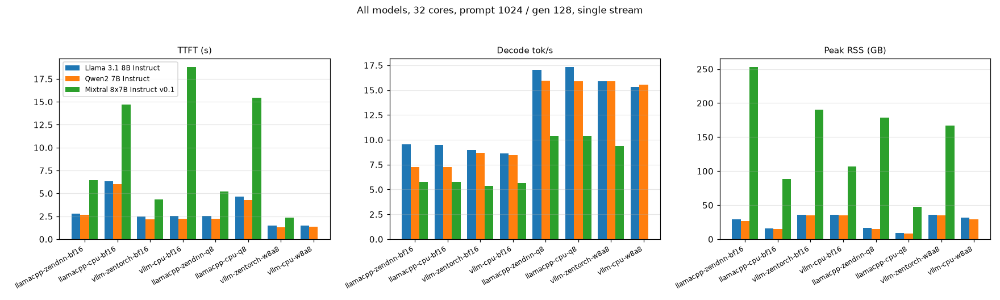
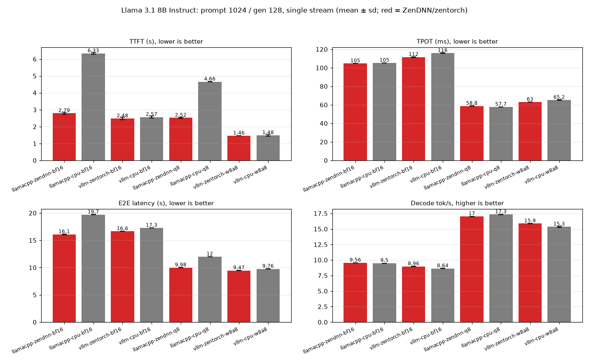
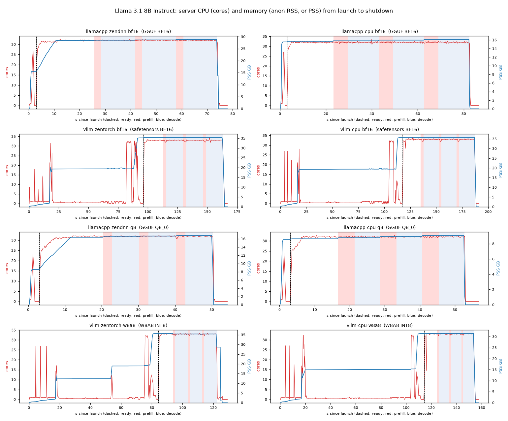
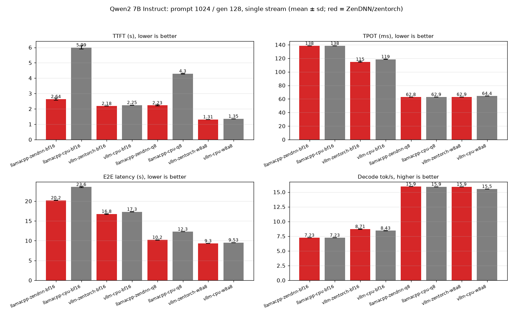
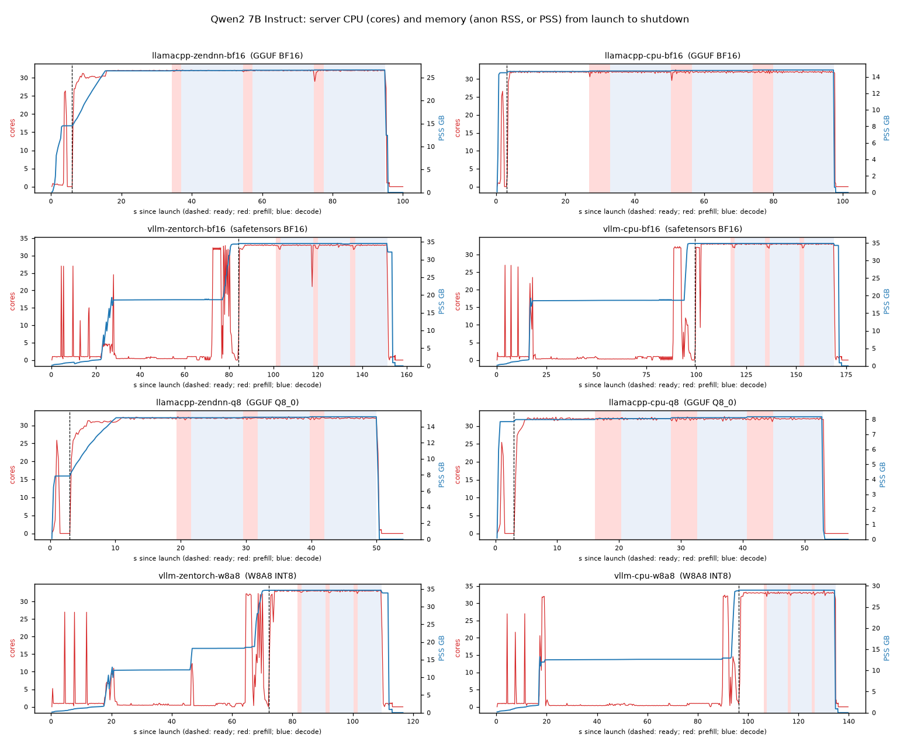
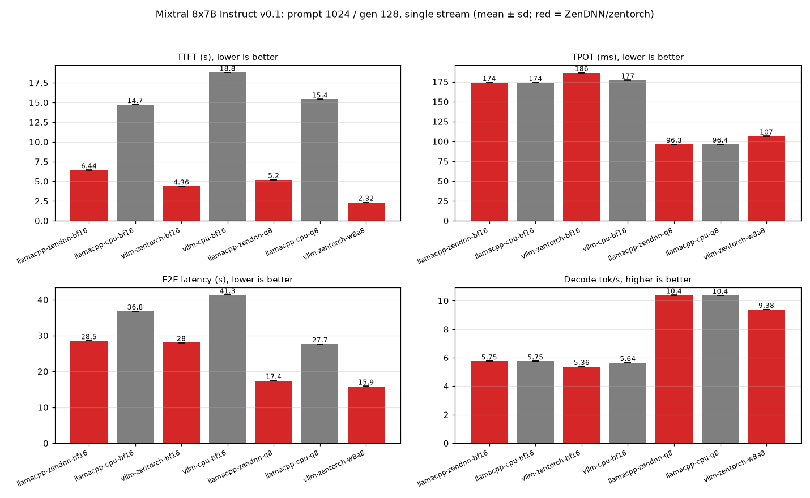
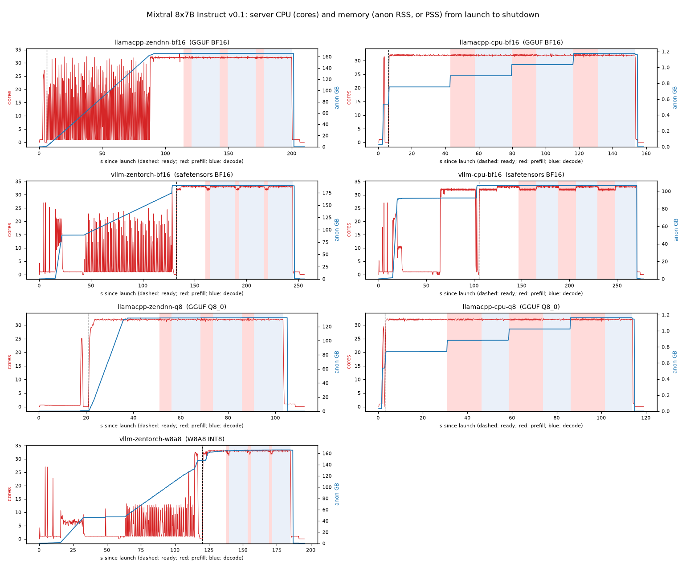

# Model × format smoke test: prompt 1024 / generate 128, 32 cores

## Setup

```
date: 2026-09-28T05:17:03+00:00
model: llama
host: volcano-a942-host  cpu: AMD EPYC 9R14 96-Core Processor
server cpus: 0-31 (+SMT 192-223 for vLLM frontend)  mem node: 0  client cpus: 96-97
llama.cpp: 9adc7f420 convert : export YaRN scaling parameters for PLaMo-3 (#29528)  LD_PRELOAD=/home/zettabolt/vllm-zen/env/lib/libiomp5.so:/home/zettabolt/vllm-zen/env/lib/libtcmalloc_minimal.so.4
vllm-zentorch: torch 2.13.0+cpu,vllm 0.28.0+cpu,zentorch 2.13.0.1
vllm-cpu: torch 2.13.0+cpu,vllm 0.28.0+cpu
```

One config at a time, 32 physical cores (CPUs 0-31, 4 CCDs), memory bound to NUMA node 0. llama.cpp serves the GGUF files (BF16, Q8_0); vLLM 0.28.0 serves the safetensors (BF16) and W8A8 INT8 checkpoints. Each format runs with ZenDNN (llama.cpp `GGML_ZENDNN=ON` build / vLLM zentorch) and without (plain llama.cpp build / stock vLLM CPU). Each request: streaming `/v1/completions`, exactly 1024 random prompt token IDs (fresh per request, prefix caching off), 128 output tokens with `ignore_eos`, temperature 0. One warmup request, then 3 measured single-request runs. TTFT = time to first token; TPOT = (E2E - TTFT) / 127.

## Overview (means)

| model | config | format | TTFT s | TPOT ms | decode tok/s | E2E s | peak RSS GB |
|---|---|---|---|---|---|---|---|
| llama | llamacpp-zendnn-bf16 | GGUF BF16 | 2.79 | 104.62 | 9.56 | 16.08 | 28.81 |
| llama | llamacpp-cpu-bf16 | GGUF BF16 | 6.33 | 105.26 | 9.5 | 19.7 | 16.11 |
| llama | vllm-zentorch-bf16 | safetensors BF16 | 2.48 | 111.56 | 8.96 | 16.65 | 35.78 |
| llama | vllm-cpu-bf16 | safetensors BF16 | 2.57 | 115.75 | 8.64 | 17.26 | 36.06 |
| llama | llamacpp-zendnn-q8 | GGUF Q8_0 | 2.52 | 58.77 | 17.02 | 9.98 | 16.81 |
| llama | llamacpp-cpu-q8 | GGUF Q8_0 | 4.66 | 57.72 | 17.32 | 11.99 | 9.09 |
| llama | vllm-zentorch-w8a8 | W8A8 INT8 | 1.46 | 63.04 | 15.86 | 9.47 | 36.09 |
| llama | vllm-cpu-w8a8 | W8A8 INT8 | 1.48 | 65.17 | 15.34 | 9.76 | 31.82 |
| qwen2 | llamacpp-zendnn-bf16 | GGUF BF16 | 2.64 | 138.24 | 7.23 | 20.19 | 26.64 |
| qwen2 | llamacpp-cpu-bf16 | GGUF BF16 | 5.99 | 138.29 | 7.23 | 23.56 | 14.83 |
| qwen2 | vllm-zentorch-bf16 | safetensors BF16 | 2.18 | 114.78 | 8.71 | 16.76 | 34.95 |
| qwen2 | vllm-cpu-bf16 | safetensors BF16 | 2.25 | 118.59 | 8.43 | 17.31 | 35.27 |
| qwen2 | llamacpp-zendnn-q8 | GGUF Q8_0 | 2.23 | 62.77 | 15.93 | 10.2 | 15.22 |
| qwen2 | llamacpp-cpu-q8 | GGUF Q8_0 | 4.3 | 62.87 | 15.91 | 12.28 | 8.17 |
| qwen2 | vllm-zentorch-w8a8 | W8A8 INT8 | 1.31 | 62.94 | 15.89 | 9.3 | 35.06 |
| qwen2 | vllm-cpu-w8a8 | W8A8 INT8 | 1.35 | 64.36 | 15.54 | 9.53 | 29.37 |
| mixtral | llamacpp-zendnn-bf16 | GGUF BF16 | 6.44 | 173.93 | 5.75 | 28.53 | 253.02 |
| mixtral | llamacpp-cpu-bf16 | GGUF BF16 | 14.72 | 173.85 | 5.75 | 36.8 | 88.19 |
| mixtral | vllm-zentorch-bf16 | safetensors BF16 | 4.36 | 186.4 | 5.36 | 28.04 | 190.22 |
| mixtral | vllm-cpu-bf16 | safetensors BF16 | 18.8 | 177.26 | 5.64 | 41.31 | 107.07 |
| mixtral | llamacpp-zendnn-q8 | GGUF Q8_0 | 5.2 | 96.26 | 10.39 | 17.42 | 178.7 |
| mixtral | llamacpp-cpu-q8 | GGUF Q8_0 | 15.42 | 96.4 | 10.37 | 27.66 | 47.4 |
| mixtral | vllm-zentorch-w8a8 | W8A8 INT8 | 2.32 | 106.62 | 9.38 | 15.86 | 166.72 |



**Failed to start or run:** mixtral/vllm-cpu-w8a8 (see `<model>/smoke.log`, `<model>/logs/`).

## Llama 3.1 8B Instruct

### Latency (mean ± sd over 3 runs)

| config | format | TTFT (s) | TPOT (ms) | E2E latency (s) | Prefill (tok/s) | Decode (tok/s) | startup s | tokens |
|---|---|---|---|---|---|---|---|---|
| llamacpp-zendnn-bf16 | GGUF BF16 | 2.790 ± 0.057 | 104.62 ± 0.03 | 16.077 ± 0.055 | 367.1 ± 7.6 | 9.56 ± 0.00 | 3.0 | ok |
| llamacpp-cpu-bf16 | GGUF BF16 | 6.334 ± 0.042 | 105.26 ± 0.03 | 19.702 ± 0.040 | 161.7 ± 1.1 | 9.50 ± 0.00 | 3.0 | ok |
| vllm-zentorch-bf16 | safetensors BF16 | 2.481 ± 0.066 | 111.56 ± 0.55 | 16.649 ± 0.004 | 413.0 ± 10.9 | 8.96 ± 0.04 | 96.0 | ok |
| vllm-cpu-bf16 | safetensors BF16 | 2.565 ± 0.066 | 115.75 ± 0.51 | 17.265 ± 0.002 | 399.4 ± 10.1 | 8.64 ± 0.04 | 117.0 | ok |
| llamacpp-zendnn-q8 | GGUF Q8_0 | 2.521 ± 0.037 | 58.77 ± 0.10 | 9.984 ± 0.050 | 406.3 ± 6.0 | 17.02 ± 0.03 | 3.0 | ok |
| llamacpp-cpu-q8 | GGUF Q8_0 | 4.661 ± 0.008 | 57.72 ± 0.03 | 11.992 ± 0.011 | 219.7 ± 0.4 | 17.32 ± 0.01 | 3.0 | ok |
| vllm-zentorch-w8a8 | W8A8 INT8 | 1.459 ± 0.010 | 63.04 ± 0.03 | 9.465 ± 0.006 | 701.8 ± 4.6 | 15.86 ± 0.01 | 84.0 | ok |
| vllm-cpu-w8a8 | W8A8 INT8 | 1.484 ± 0.038 | 65.17 ± 0.39 | 9.761 ± 0.012 | 690.3 ± 17.3 | 15.34 ± 0.09 | 114.0 | ok |

### ZenDNN speedup (baseline / accelerated)

| pair | with ZenDNN | without | TTFT speedup | TPOT speedup | E2E speedup |
|---|---|---|---|---|---|
| llama.cpp BF16 | llamacpp-zendnn-bf16 | llamacpp-cpu-bf16 | 2.27x | 1.01x | 1.23x |
| vLLM BF16 | vllm-zentorch-bf16 | vllm-cpu-bf16 | 1.03x | 1.04x | 1.04x |
| llama.cpp Q8_0 | llamacpp-zendnn-q8 | llamacpp-cpu-q8 | 1.85x | 0.98x | 1.20x |
| vLLM W8A8 | vllm-zentorch-w8a8 | vllm-cpu-w8a8 | 1.02x | 1.03x | 1.03x |



### CPU and memory profile

| config | format | mem | peak mem GB | mem in run GB | peak RSS GB | node mem +GB | cores prefill | cores decode | busy % prefill | busy % decode | cores idle | threads | procs |
|---|---|---|---|---|---|---|---|---|---|---|---|---|---|
| llamacpp-zendnn-bf16 | GGUF BF16 | PSS | 28.82 | 28.53 | 28.81 | 0.46 | 31.97 | 32.0 | 100.0 | 99.99 | 31.84 | 419 | 1 |
| llamacpp-cpu-bf16 | GGUF BF16 | PSS | 16.1 | 15.82 | 16.11 | 1.09 | 32.0 | 31.99 | 100.0 | 99.98 | 31.96 | 419 | 1 |
| vllm-zentorch-bf16 | safetensors BF16 | PSS | 35.36 | 35.36 | 35.78 | 14.57 | 32.43 | 33.0 | 99.97 | 99.96 | 32.98 | 414 | 7 |
| vllm-cpu-bf16 | safetensors BF16 | PSS | 35.69 | 35.66 | 36.06 | 35.74 | 32.42 | 33.01 | 99.99 | 100.0 | 32.99 | 415 | 7 |
| llamacpp-zendnn-q8 | GGUF Q8_0 | PSS | 16.81 | 16.53 | 16.81 | 8.81 | 31.92 | 31.99 | 99.73 | 100.0 | 31.38 | 419 | 1 |
| llamacpp-cpu-q8 | GGUF Q8_0 | PSS | 9.09 | 8.81 | 9.09 | 1.08 | 32.0 | 32.0 | 100.0 | 100.0 | 31.92 | 419 | 1 |
| vllm-zentorch-w8a8 | W8A8 INT8 | PSS | 35.67 | 35.41 | 36.09 | 35.44 | 32.63 | 32.82 | 99.84 | 99.42 | 33.0 | 414 | 6 |
| vllm-cpu-w8a8 | W8A8 INT8 | PSS | 31.43 | 31.41 | 31.82 | 31.17 | 32.7 | 33.02 | 99.98 | 100.0 | 32.99 | 415 | 5 |



## Qwen2 7B Instruct

### Latency (mean ± sd over 3 runs)

| config | format | TTFT (s) | TPOT (ms) | E2E latency (s) | Prefill (tok/s) | Decode (tok/s) | startup s | tokens |
|---|---|---|---|---|---|---|---|---|
| llamacpp-zendnn-bf16 | GGUF BF16 | 2.636 ± 0.076 | 138.24 ± 0.02 | 20.193 ± 0.074 | 388.7 ± 11.3 | 7.23 ± 0.00 | 6.0 | ok |
| llamacpp-cpu-bf16 | GGUF BF16 | 5.993 ± 0.108 | 138.29 ± 0.04 | 23.555 ± 0.109 | 170.9 ± 3.1 | 7.23 ± 0.00 | 3.0 | ok |
| vllm-zentorch-bf16 | safetensors BF16 | 2.182 ± 0.002 | 114.78 ± 0.71 | 16.760 ± 0.089 | 469.2 ± 0.5 | 8.71 ± 0.05 | 84.0 | ok |
| vllm-cpu-bf16 | safetensors BF16 | 2.245 ± 0.002 | 118.59 ± 0.22 | 17.306 ± 0.030 | 456.1 ± 0.5 | 8.43 ± 0.02 | 99.0 | ok |
| llamacpp-zendnn-q8 | GGUF Q8_0 | 2.227 ± 0.033 | 62.77 ± 0.01 | 10.199 ± 0.034 | 460.0 ± 6.9 | 15.93 ± 0.00 | 3.0 | ok |
| llamacpp-cpu-q8 | GGUF Q8_0 | 4.296 ± 0.021 | 62.87 ± 0.03 | 12.281 ± 0.024 | 238.4 ± 1.1 | 15.91 ± 0.01 | 3.0 | ok |
| vllm-zentorch-w8a8 | W8A8 INT8 | 1.311 ± 0.001 | 62.94 ± 0.03 | 9.305 ± 0.004 | 781.0 ± 0.4 | 15.89 ± 0.01 | 72.0 | ok |
| vllm-cpu-w8a8 | W8A8 INT8 | 1.353 ± 0.001 | 64.36 ± 0.05 | 9.527 ± 0.006 | 756.6 ± 0.4 | 15.54 ± 0.01 | 96.0 | ok |

### ZenDNN speedup (baseline / accelerated)

| pair | with ZenDNN | without | TTFT speedup | TPOT speedup | E2E speedup |
|---|---|---|---|---|---|
| llama.cpp BF16 | llamacpp-zendnn-bf16 | llamacpp-cpu-bf16 | 2.27x | 1.00x | 1.17x |
| vLLM BF16 | vllm-zentorch-bf16 | vllm-cpu-bf16 | 1.03x | 1.03x | 1.03x |
| llama.cpp Q8_0 | llamacpp-zendnn-q8 | llamacpp-cpu-q8 | 1.93x | 1.00x | 1.20x |
| vLLM W8A8 | vllm-zentorch-w8a8 | vllm-cpu-w8a8 | 1.03x | 1.02x | 1.02x |



### CPU and memory profile

| config | format | mem | peak mem GB | mem in run GB | peak RSS GB | node mem +GB | cores prefill | cores decode | busy % prefill | busy % decode | cores idle | threads | procs |
|---|---|---|---|---|---|---|---|---|---|---|---|---|---|
| llamacpp-zendnn-bf16 | GGUF BF16 | PSS | 26.64 | 26.52 | 26.64 | 17.94 | 31.79 | 32.0 | 99.38 | 100.0 | 31.96 | 419 | 1 |
| llamacpp-cpu-bf16 | GGUF BF16 | PSS | 14.83 | 14.7 | 14.83 | 0.61 | 31.94 | 32.0 | 99.82 | 100.0 | 31.97 | 419 | 1 |
| vllm-zentorch-bf16 | safetensors BF16 | PSS | 34.57 | 34.52 | 34.95 | 30.51 | 32.48 | 32.89 | 99.99 | 99.64 | 32.97 | 414 | 7 |
| vllm-cpu-bf16 | safetensors BF16 | PSS | 34.89 | 34.86 | 35.27 | 34.76 | 32.46 | 33.01 | 99.99 | 100.0 | 33.0 | 415 | 6 |
| llamacpp-zendnn-q8 | GGUF Q8_0 | PSS | 15.22 | 15.1 | 15.22 | 7.64 | 32.0 | 32.0 | 99.98 | 100.0 | 31.62 | 419 | 1 |
| llamacpp-cpu-q8 | GGUF Q8_0 | PSS | 8.17 | 8.04 | 8.17 | 0.57 | 31.99 | 32.0 | 99.98 | 99.99 | 31.96 | 419 | 1 |
| vllm-zentorch-w8a8 | W8A8 INT8 | PSS | 34.67 | 34.63 | 35.06 | 33.98 | 32.81 | 33.01 | 99.96 | 100.0 | 32.93 | 414 | 5 |
| vllm-cpu-w8a8 | W8A8 INT8 | PSS | 28.97 | 28.97 | 29.37 | 28.74 | 32.76 | 32.47 | 100.0 | 98.3 | 32.99 | 415 | 5 |



## Mixtral 8x7B Instruct v0.1

### Latency (mean ± sd over 3 runs)

| config | format | TTFT (s) | TPOT (ms) | E2E latency (s) | Prefill (tok/s) | Decode (tok/s) | startup s | tokens |
|---|---|---|---|---|---|---|---|---|
| llamacpp-zendnn-bf16 | GGUF BF16 | 6.445 ± 0.034 | 173.93 ± 0.07 | 28.535 ± 0.026 | 158.9 ± 0.8 | 5.75 ± 0.00 | 6.0 | ok |
| llamacpp-cpu-bf16 | GGUF BF16 | 14.718 ± 0.017 | 173.85 ± 0.08 | 36.796 ± 0.027 | 69.6 ± 0.1 | 5.75 ± 0.00 | 6.0 | ok |
| vllm-zentorch-bf16 | safetensors BF16 | 4.363 ± 0.001 | 186.40 ± 0.34 | 28.036 ± 0.043 | 234.7 ± 0.1 | 5.36 ± 0.01 | 132.0 | ok |
| vllm-cpu-bf16 | safetensors BF16 | 18.796 ± 0.006 | 177.26 ± 0.07 | 41.309 ± 0.014 | 54.5 ± 0.0 | 5.64 ± 0.00 | 105.0 | ok |
| llamacpp-zendnn-q8 | GGUF Q8_0 | 5.196 ± 0.027 | 96.26 ± 0.07 | 17.421 ± 0.018 | 197.1 ± 1.0 | 10.39 ± 0.01 | 21.0 | ok |
| llamacpp-cpu-q8 | GGUF Q8_0 | 15.416 ± 0.020 | 96.40 ± 0.07 | 27.659 ± 0.017 | 66.4 ± 0.1 | 10.37 ± 0.01 | 3.0 | ok |
| vllm-zentorch-w8a8 | W8A8 INT8 | 2.323 ± 0.006 | 106.62 ± 0.06 | 15.863 ± 0.012 | 440.9 ± 1.2 | 9.38 ± 0.01 | 120.0 | ok |

### ZenDNN speedup (baseline / accelerated)

| pair | with ZenDNN | without | TTFT speedup | TPOT speedup | E2E speedup |
|---|---|---|---|---|---|
| llama.cpp BF16 | llamacpp-zendnn-bf16 | llamacpp-cpu-bf16 | 2.28x | 1.00x | 1.29x |
| vLLM BF16 | vllm-zentorch-bf16 | vllm-cpu-bf16 | 4.31x | 0.95x | 1.47x |
| llama.cpp Q8_0 | llamacpp-zendnn-q8 | llamacpp-cpu-q8 | 2.97x | 1.00x | 1.59x |



### CPU and memory profile

| config | format | mem | peak mem GB | mem in run GB | peak RSS GB | node mem +GB | cores prefill | cores decode | busy % prefill | busy % decode | cores idle | threads | procs |
|---|---|---|---|---|---|---|---|---|---|---|---|---|---|
| llamacpp-zendnn-bf16 | GGUF BF16 | anon | 165.99 | 165.57 | 253.02 | 166.4 | 31.99 | 32.0 | 99.96 | 100.0 | 14.96 | 419 | 1 |
| llamacpp-cpu-bf16 | GGUF BF16 | anon | 1.18 | 1.04 | 88.19 | 1.31 | 32.0 | 32.0 | 100.0 | 100.0 | 32.0 | 419 | 1 |
| vllm-zentorch-bf16 | safetensors BF16 | anon | 189.56 | 189.55 | 190.22 | 189.86 | 32.23 | 33.0 | 99.99 | 99.98 | 32.96 | 420 | 5 |
| vllm-cpu-bf16 | safetensors BF16 | anon | 106.43 | 106.43 | 107.07 | 106.58 | 32.04 | 33.01 | 99.96 | 100.0 | 32.68 | 421 | 6 |
| llamacpp-zendnn-q8 | GGUF Q8_0 | anon | 132.45 | 132.17 | 178.7 | 178.51 | 31.96 | 32.0 | 99.93 | 100.0 | 31.98 | 419 | 1 |
| llamacpp-cpu-q8 | GGUF Q8_0 | anon | 1.16 | 0.9 | 47.4 | 1.22 | 32.0 | 32.0 | 100.0 | 100.0 | 32.0 | 419 | 1 |
| vllm-zentorch-w8a8 | W8A8 INT8 | anon | 166.05 | 165.39 | 166.72 | 163.07 | 32.41 | 32.92 | 99.87 | 99.7 | 32.96 | 420 | 6 |



## Profile columns

CPU and memory are sampled every 0.25 s from server launch to shutdown, summed over every process in the server's session (vLLM runs an API server plus an engine-core process). **cores** = CPU time per wall second (32 = all compute cores busy); **busy %** = mean busy share of CPUs 0-31 from /proc/stat; prefill = request start to first token, decode = first token to last. **RSS** includes llama.cpp's mmap'd GGUF pages and counts shared libraries once per vLLM process (~1 GB each). **mem** = which column the profile carries: **anon** (RssAnon, heap only: excludes mmap'd weights) or **PSS** (smaps_rollup). Configs profiled with PSS ran slower during startup and warmup: reading smaps_rollup takes the server's mmap lock for a page-table walk (~1.5 s at 140 GB) and slowed a faulting vLLM worker ~11x, so their startup times and first-request (warmup) TTFTs are inflated (Llama vLLM zentorch BF16 startup 96 s vs 51 s; Mixtral llama.cpp ZenDNN BF16 first request 846 s vs 86 s). Measured runs were barely affected: a Llama rerun with the current sampler matched within 5% TTFT and 0.5% TPOT (<code>_validate_llama/</code>). **node mem +GB** = rise in NUMA node 0 MemUsed (includes page cache). **cores idle** = median cores between requests (spinning OpenMP threads show up here).

## Caveats

Smoke test: 3 single-request runs per config, no stability gating. Q8_0 (GGUF block INT8 weights) and W8A8 (INT8 weights + dynamic per-token INT8 activations) are different schemes. Llama and Qwen2 W8A8 are RedHatAI (SmoothQuant + GPTQ); Mixtral W8A8 was made locally with round-to-nearest (`scripts/quantize_w8a8.py`). Mixtral GGUFs were converted locally from the HF checkpoint. The client sits on socket 1 next to idle k3s containers.
