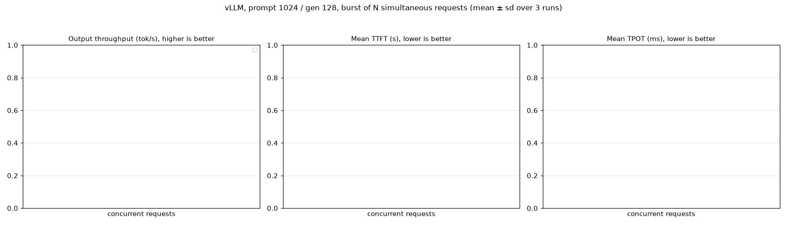
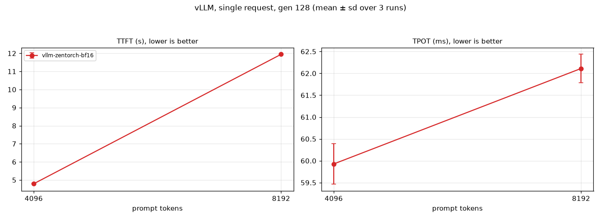

# vLLM with vs without zentorch: prompt-length and concurrency sweep

## Setup

```
date: 2026-09-27T19:21:24+00:00
host: volcano-a942-host  cpu: AMD EPYC 9R14 96-Core Processor
server cpus: 0-95 (+SMT 192-287 for vLLM frontend)  mem node: 0  client cpus: 96-99
scenarios (prompt:gen:concurrency): 4096:128:1 8192:128:1 1024:128:4 1024:128:16 1024:128:64  runs: 3
vllm-zentorch: torch 2.13.0+cpu,vllm 0.28.0+cpu,zentorch 2.13.0.1
vllm-cpu: torch 2.13.0+cpu,vllm 0.28.0+cpu
```

One vLLM server per (env, model), pinned with numactl to the server CPUs (compute threads via VLLM_CPU_OMP_THREADS_BIND, frontend on SMT siblings) and memory-bound to the local NUMA node; the client runs on the other socket. Each scenario: 1 warmup request, then 3 runs; a run is a burst of N simultaneous streaming /v1/completions requests with exact-length token-ID prompts (fresh random ids per request, prefix caching off), max_tokens=128, ignore_eos. Output tok/s = N x 128 / burst wall time; total tok/s also counts prompt tokens. TTFT/TPOT are per-request means within a burst, then averaged over runs.

## zentorch speedup (zentorch / stock; > 1 means zentorch is faster)

_no pairs_






## All results (mean ± sd over runs)

| config | prompt | concurrency | runs | output tok/s | total tok/s | mean TTFT s | max TTFT s | mean TPOT ms | burst wall s | token mismatches |
|---|---|---|---|---|---|---|---|---|---|---|
| vllm-zentorch-bf16 | 4096 | 1 | 3 | 10.3 ± 0.0 | 341 ± 1 | 4.79 ± 0.03 | 4.79 | 59.9 ± 0.5 | 12.40 ± 0.04 | 0 |
| vllm-zentorch-bf16 | 8192 | 1 | 3 | 6.5 ± 0.0 | 419 ± 1 | 11.95 ± 0.01 | 11.95 | 62.1 ± 0.3 | 19.84 ± 0.05 | 0 |

## Kernel / scheduler evidence from server logs

```
```

## Server commands

```
vllm-zentorch-bf16: source /home/zettabolt/vllm-zen/env-zentorch.sh && export VLLM_CPU_OMP_THREADS_BIND=0-95 VLLM_CPU_KVCACHE_SPACE=32 && cd /tmp && exec numactl --physcpubind=0-95,192-287 --membind=0 vllm serve /home/zettabolt/mkumar/models/Llama-3.1-8B-Instruct --served-model-name llama --dtype bfloat16 --max-model-len 9216 --no-enable-prefix-caching --host 127.0.0.1 --port 8320
```
